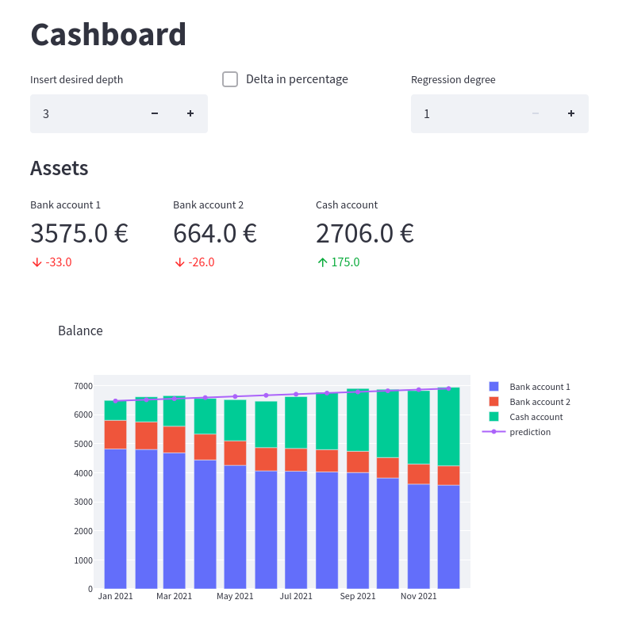

# Cashboard

This tool lets you visualize a GNUCash database as a simple dashboard.



To run it you should first export:

```
export PYTHONPATH=$(pwd)
```

and then use 
```
streamlit run ui/main.py
```